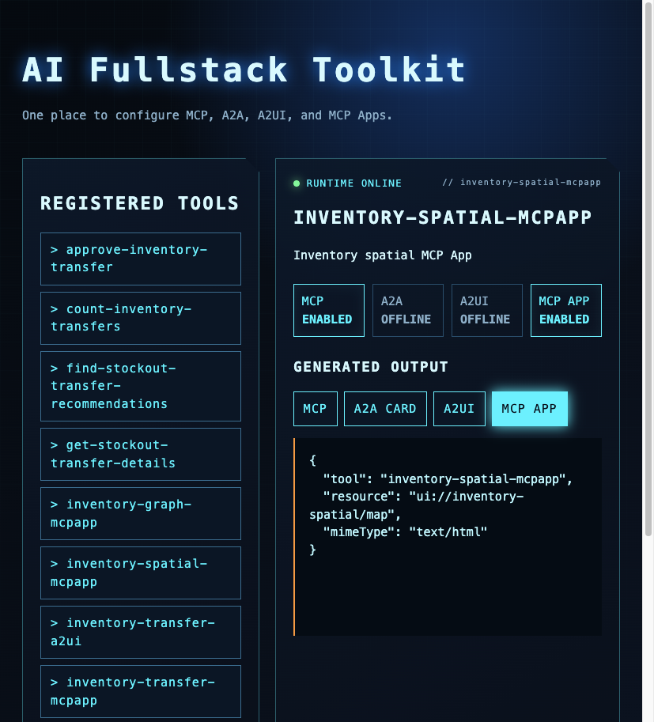
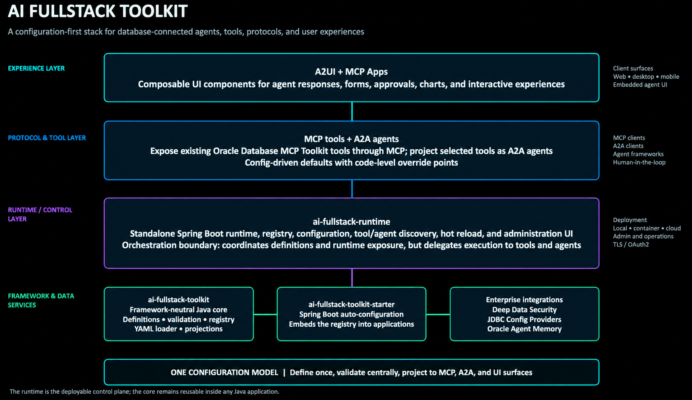
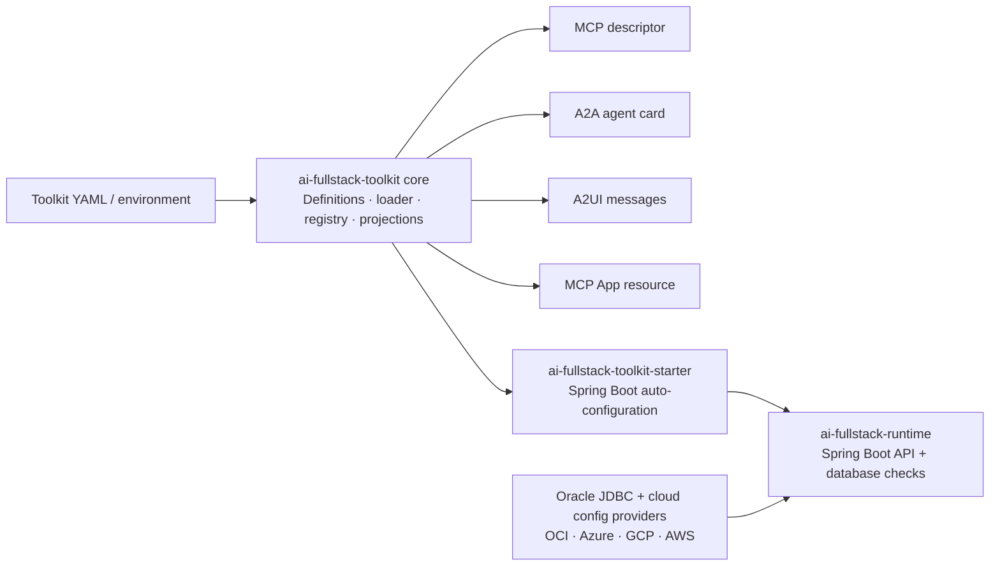
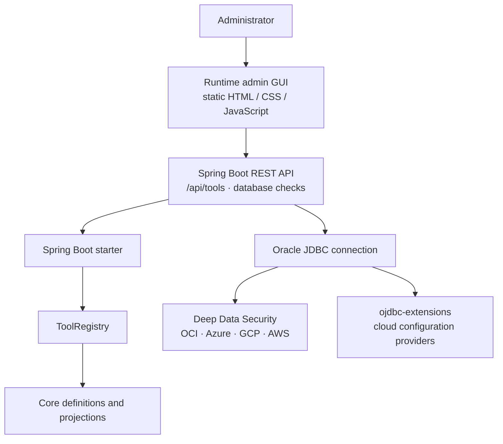

# AI Fullstack Toolkit

AI Fullstack Toolkit provides a common Java execution framework for **MCP, A2A, A2UI, and MCP Apps**. Register a validated business operation once, bind its backend, and opt it into the required surfaces. The existing Oracle Database MCP Java Toolkit remains the database execution foundation; the framework delegates to it over MCP rather than implementing another SQL engine.

The new [GCP workflow simulator](examples/gcp-workflow-simulator/README.md) exercises the read → graph → map → review → approve flow using real protocol transports and explicitly simulated backends. **No GCP demo source, deployment, connector, Oracle profile, or database data was changed.**



AI Fullstack Toolkit makes one business-tool definition available across four complementary AI surfaces:

| Surface | Executable framework support |
| --- | --- |
| MCP | Official Java SDK Streamable HTTP server; discovery, validated calls, structured results, resources |
| A2A | Agent card and synchronous JSON-RPC `message/send`; shares the MCP execution catalog |
| A2UI | Declarative v0.8 review form, caller-bound approval, expiry and replay rejection |
| MCP Apps | `_meta.ui.resourceUri`, bundled HTML resources, official Apps bridge, interactive Cytoscape/MapLibre views |

It deliberately has only three publishable Maven artifacts:

1. `ai-fullstack-toolkit` — framework-neutral definitions, YAML loader, executable catalog, backend SPI, provenance/audit events, approval gate, and projections.
2. `ai-fullstack-toolkit-starter` — opt-in Spring Boot protocol adapters and an allowlisted Oracle toolkit MCP client adapter.
3. `ai-fullstack-runtime` — standalone Spring Boot runtime and configuration UI.

Both example applications are non-published. The upstream Oracle Database MCP Java Toolkit remains pinned and unmodified under [`upstream/`](UPSTREAM.md). `OracleToolkitBackend` calls an authenticated, initialized MCP client connected to that server; it does not import the server implementation or bypass its database governance.

The runtime includes Oracle JDBC Driver Extensions for centralized configuration and authentication across OCI, Microsoft Azure, Google Cloud Platform (GCP), and Amazon Web Services (AWS). These providers are loaded through JDBC's standard service-provider mechanism, so existing JDBC URLs and properties can select the cloud configuration provider without application-code changes. See the [ojdbc-extensions project](https://github.com/oracle/ojdbc-extensions) for provider URL and property formats.

Database authorization and security policies remain enforced by Oracle and the upstream toolkit. This framework does not itself configure or verify Data Safe / Deep Data Security policies.

## Shared execution architecture

```text
MCP tools / A2A message/send
        → Operations: exposure + input validation + server-owned backend binding
            → read Backend: existing managed Oracle agent client (future GCP wiring)
                → structured result + backend evidence → MCP App (graph/map)
            → review handler → A2UI → explicit user action → ApprovalGate
                → OracleToolkitBackend → existing Oracle MCP toolkit → database write
```

The simulator substitutes **only the backend implementations and caller identity**. Its protocol endpoints, input validation, approval gate, and MCP App bridge are real. A simple risk-list operation has no UI resource metadata, so it returns a table without launching graph/map apps. Raw evidence supplied by a model is not an accepted input.

See [framework integration and boundaries](docs/common-framework.md) for registration, upstream toolkit delegation, authentication, protocol versions, and what must be completed before a production migration.

### Existing descriptor dashboard





### Spring Boot starter and admin GUI



## Quick start: executable workflow simulator

Prerequisites: JDK 17+, Maven 3.9+, and Node.js 22.12+ with npm. Maven installs the lockfile-pinned frontend dependencies and bundles the UI into the simulator JAR. The build needs dependency-download access; the running simulator needs no cloud access, credentials, tile provider, or external JavaScript CDN.

```bash
./build_all.sh
java -jar examples/gcp-workflow-simulator/target/gcp-workflow-simulator-0.1.0-SNAPSHOT.jar
```

Open **http://127.0.0.1:8082**. Use the four buttons, or these supported test-host prompts:

1. `List SKUs with risk of stock outages`
2. `Show the supply chain graph for SKU-500.`
3. `Show the spatial hotspot map for SKU-500.`
4. `Suggest inventory transfers.`

Step 4 reviews at risk ≥70/100, at most three suggestions. It executes **zero writes** until you click **Approve this transfer**. Even then only an in-memory simulated write is recorded. Replace `SKU-500` with `SKU-APAC-210` or `SKU-700` to exercise distinct graph/map results; unknown SKUs fail without fallback. The prompt parser is deliberately limited and is not an LLM.

The map uses an offline coordinate grid, geographic markers and a connecting line; it is not a street-map provider or a driving-route calculation. Pan/zoom and warehouse clicks work without external network access.

### Browser tests

Stop any manually running simulator first; the tests start their own instance on port 8082.

```bash
cd examples/gcp-workflow-simulator/frontend
npx playwright install chromium
npm test
```

Java tests cover schema/exposure checks, A2A/MCP execution, resource discovery, dynamic fixtures, no fallback, toolkit-adapter wire delegation, origin rejection, and approval expiry/replay. Browser tests cover the four-step flow, iframe initialization, clickable/moving markers, SKU changes, plain lists, and explicit approval. Screenshots are generated under the example's `target/` directory and are not committed.

These tests prove **framework behavior against simulated backends**, not a live Oracle query, property-graph execution, OAuth renewal, Gemini rendering, or a production transfer.

## Run the existing descriptor dashboard

```bash
java -jar runtime/target/ai-fullstack-runtime-0.1.0-SNAPSHOT.jar
```

Open [http://localhost:8080](http://localhost:8080). The **AI Fullstack Toolkit** dashboard displays the seeded definitions and their enabled surfaces. Select each output tab to view the generated MCP descriptor, A2A card, A2UI messages, or MCP App resource descriptor. Use **Create** to create or replace a definition in the running registry. This first runtime configuration store is intentionally in-memory: restart restores the seeded definition, which makes the demo safe to explore.

## Seeded supply-chain surfaces

| Tool | MCP | A2A | A2UI | MCP App |
| --- | --- | --- | --- | --- |
| `inventory-transfer-a2ui` | disabled | enabled | enabled | disabled |
| `inventory-spatial-mcpapp` | enabled | disabled | disabled | enabled |
| `inventory-graph-mcpapp` | enabled | disabled | disabled | enabled |

The runtime also imports the checked-in Oracle Database MCP Java Toolkit `tools.yaml` snapshot as MCP-only definitions. This makes the SQL surface visible as `oracle-sql`, alongside the existing supply-chain toolkit entries such as `find-stockout-transfer-recommendations` and `approve-inventory-transfer`. For each imported configured tool, the MCP tab also displays its exact SQL statement or PL/SQL block. The imported configuration has placeholders only (`${DB_URL}`, `${DB_USERNAME}`, `${DB_PASSWORD}`); it contains no database secret.

## Walkthrough: inventory transfer

1. Start the runtime with the command above.
2. Select `inventory-transfer-a2ui`. Its tiles show only **A2A** and **A2UI** enabled. The A2A card has an addressable inventory-transfer skill, and the A2UI tab begins the `inventory-transfer-review` surface.
3. Select `inventory-spatial-mcpapp` or `inventory-graph-mcpapp`. Their tiles show only **MCP** and **MCP APP** enabled. Use the MCP APP tab to inspect the interactive resource URI.
4. Select `inventory-transfer-a2ui`. Its tiles show **A2A** and **A2UI** enabled, with MCP App disabled. This is the agent-driven review surface; any production write must remain behind an explicit, authenticated approval workflow.
5. Select `oracle-sql` or an imported supply-chain tool to inspect the MCP descriptor and input schema imported from the Oracle toolkit catalog.
6. Use **Create** to add a definition. The UI performs a `PUT /api/tools/{id}` and immediately regenerates all enabled projections.

Equivalent HTTP inspection:

```bash
curl -s http://localhost:8080/api/tools | jq
curl -s http://localhost:8080/api/tools/inventory-transfer-a2ui/a2a/card | jq
curl -s http://localhost:8080/api/tools/inventory-transfer-a2ui/a2ui/example | jq
curl -s http://localhost:8080/api/tools/inventory-spatial-mcpapp/mcp-app | jq
curl -s http://localhost:8080/api/tools/oracle-sql/mcp | jq
```

## Demonstrating database access

Use **DATABASE CHECK** in the dashboard, or call the equivalent endpoint:

```bash
curl -s 'http://localhost:8080/api/tools/database/spatial-demo?sku=SKU-500' | jq
```

It runs the supply-chain spatial lookup with the runtime's configured Oracle JDBC connection. A real database result is unambiguous: the response has `"sourceMode": "oracle-database"`, along with the resolved inventory locations. If it returns `"sourceMode": "seeded-demo"`, the response's `sourceDetail` identifies why the live connection was unavailable; that is intentionally not presented as a database demonstration. Configure `DB_USERNAME`, `DB_PASSWORD`, `DB_DSN`, and, for wallet connections, `TNS_ADMIN` (or `DB_WALLET_DIR`) before starting the runtime.

## Configuration format

The core can load a portable application YAML document. It is deliberately named as toolkit configuration rather than presented as an MCP standard:

```yaml
tools:
  inventory-transfer:
    description: Move SKU inventory between two locations.
    inputs:
      sku: string
      quantity: integer
    mcp:
      enabled: true
    a2a:
      enabled: true
      name: Inventory Transfer Agent
      version: 0.1.0
    a2ui:
      enabled: true
      surface: inventory-transfer-review
    mcpApp:
      enabled: true
      resource: ui://inventory-transfer/review
```

Use it directly from Java:

```java
var definitions = new ToolkitConfigurationLoader().load(inputStream);
definitions.forEach(registry::register);
```

## Spring Boot integration

Add the starter to an existing service, then inject `ToolRegistry` and register a `ToolDefinition`. The registry remains independent of Spring, so the same definitions can run in a CLI, servlet, or another framework. The included [`examples/inventory-transfer-demo`](examples/inventory-transfer-demo/README.md) demonstrates the smallest useful Spring Boot service:

```bash
mvn -pl core,starter -am install -DskipTests
mvn -pl examples/inventory-transfer-demo spring-boot:run
curl -s http://localhost:8081/demo/a2a-card | jq
```

## Current scope and production boundary

The common framework now executes registered handlers; the older runtime dashboard still previews descriptors and has its own legacy JDBC demonstration. Merely creating a dashboard definition does **not** register executable code. The old JDBC demo's seeded fallback is not used by the common execution path or simulator.

Protocol adapters are disabled unless `fullstack.protocols.enabled=true`. The default caller resolver requires a container-authenticated principal. The simulator deliberately overrides that resolver and binds to loopback; **do not deploy its identity or fixtures as a production service**. Authentication/OAuth deployment, durable approvals/audit, database transaction idempotency, and live host compatibility remain application responsibilities. The in-memory approval gate prevents repeat dispatch in one process, but cannot guarantee exactly-once database execution across restarts or distributed instances.
